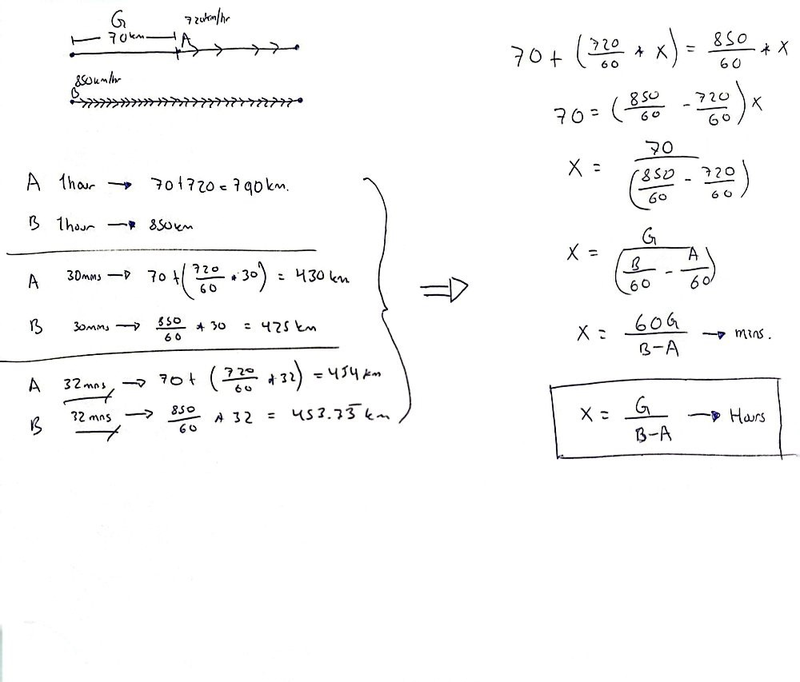

# Tortoise_Racing

Two tortoises named A and B must run a race. A starts with an average speed of V1 feet per hour. Young B knows she runs faster than A, and furthermore has not finished her cabbage.

When she starts, at last, she can see that A has a G feet lead but B's speed is V2 feet per hour. How long will it take B to catch A?

The result will be an array [hour, min, sec] which is the time needed in hours, minutes and seconds.

If v1 >= v2 then return null


## Installation

Install my-project with npm

```bash
  cd my-project
  npm install typescript --save-dev
  tsc --init
```
    
## Usage/Examples

```javascript
tsc --watch
```


## Authors

- [@DavidGarciaManzana](https://github.com/DavidGarciaManzana)


## Acknowledgements

 - [Tortoise racing - Codewars](https://www.codewars.com/kata/55e2adece53b4cdcb900006c)

## Math calculations


